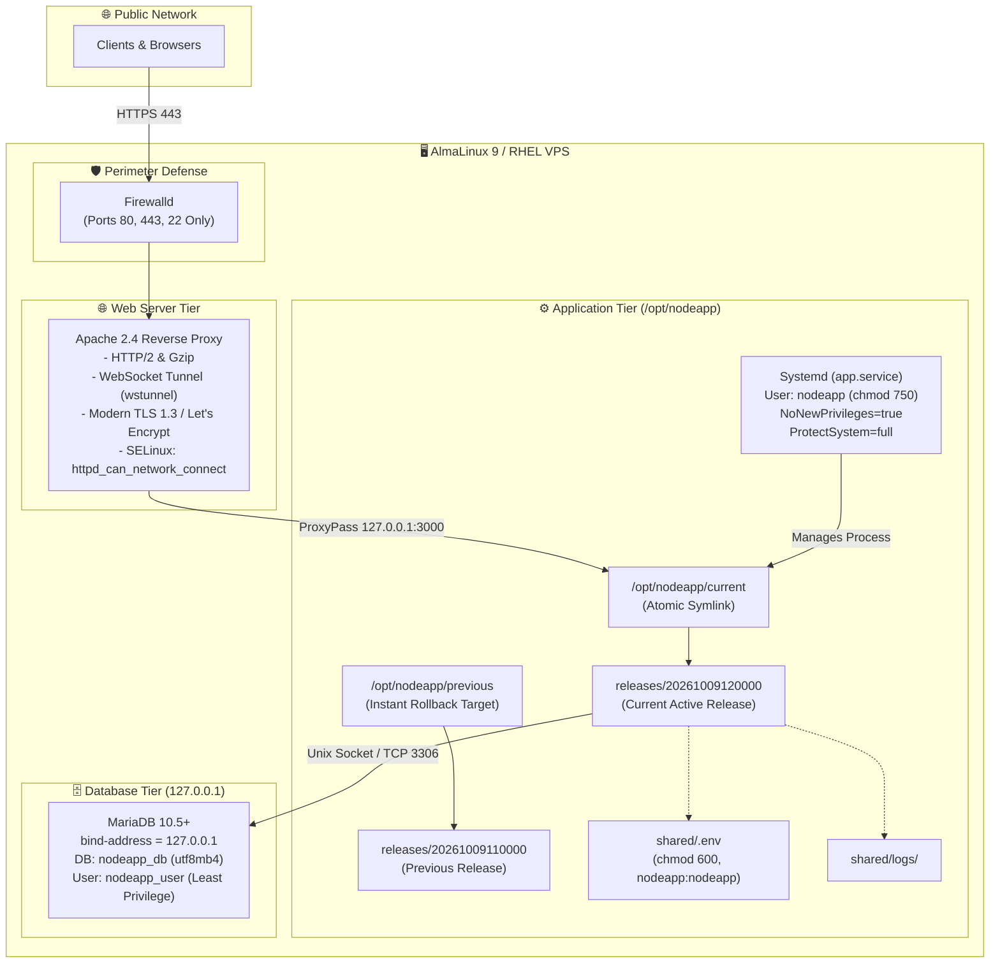

# AlmaLinux 9 Node.js VPS DeployKit

[](https://github.com/jdymitarai/almalinux-nodejs-vps-deploykit/actions/workflows/ci.yml)
[](LICENSE)
[](https://almalinux.org/)
[](https://nodejs.org/)
[](https://mariadb.org/)

A battle-hardened, production-grade automated deployment toolkit and operational framework designed for running Node.js applications on **AlmaLinux 9** and **RHEL 9 VPS** environments (including Bluehost VPS, cPanel/WHM root environments, and bare enterprise Linux cloud servers).

Provides an idempotent pipeline with **atomic zero-downtime releases**, **instant rollback mechanisms**, **Linux kernel security sandboxing**, **Apache 2.4 HTTP/2 + WebSocket reverse proxying**, and **isolated MariaDB provisioning**.

---

## 🏛 Architecture Diagram

### Mermaid Architecture Topology


### ASCII Architecture Representation
```
                    [ Public Client Traffic: HTTPS / Port 443 ]
                                        │
                                        ▼
   ┌────────────────────────────────────────────────────────────────────────┐
   │ AlmaLinux 9 VPS Host (Enterprise Hardened)                             │
   │                                                                        │
   │   ┌────────────────────────────────────────────────────────────────┐   │
   │   │ Firewalld (Ports: 22 [SSH], 80 [HTTP], 443 [HTTPS])            │   │
   │   │ Port 3000 strictly blocked from external network interfaces    │   │
   │   └───────────────────────────────┬────────────────────────────────┘   │
   │                                   ▼                                    │
   │   ┌────────────────────────────────────────────────────────────────┐   │
   │   │ Apache 2.4 (httpd) Reverse Proxy                               │   │
   │   │ - HTTP/2 Protocol + Gzip/Deflate compression                   │   │
   │   │ - WebSocket upgrade handling (mod_proxy_wstunnel)              │   │
   │   │ - Modern TLS 1.2 / TLS 1.3 ciphers + HSTS security headers    │   │
   │   │ - SELinux: httpd_can_network_connect = 1                       │   │
   │   └───────────────────────────────┬────────────────────────────────┘   │
   │                                   │ 127.0.0.1:3000 (Loopback Only)     │
   │                                   ▼                                    │
   │   ┌────────────────────────────────────────────────────────────────┐   │
   │   │ Systemd Service: app.service                                   │   │
   │   │ - Non-root dedicated user: nodeapp (chmod 750 isolation)       │   │
   │   │ - Kernel sandboxing: NoNewPrivileges=true, ProtectSystem=full  │   │
   │   │ - Auto-restart on failure: Restart=always (3s backoff)         │   │
   │   │                                                                │   │
   │   │  /opt/nodeapp/                                                 │   │
   │   │   ├── current  ──────────────────► releases/20261009120000     │   │
   │   │   ├── previous (Rollback Pointer)► releases/20261009110000     │   │
   │   │   ├── shared/                                                  │   │
   │   │   │    ├── .env (chmod 600, nodeapp:nodeapp)                   │   │
   │   │   │    └── logs/                                               │   │
   │   │   └── releases/ (Pruned automatically to 5 releases)           │   │
   │   └───────────────────────────────┬────────────────────────────────┘   │
   │                                   │ 127.0.0.1:3306 (Local Socket)      │
   │                                   ▼                                    │
   │   ┌────────────────────────────────────────────────────────────────┐   │
   │   │ MariaDB Service (bind-address = 127.0.0.1)                     │   │
   │   │ - Database: nodeapp_db (utf8mb4_unicode_ci)                    │   │
   │   │ - User: nodeapp_user@localhost (Least privilege grants)        │   │
   │   └────────────────────────────────────────────────────────────────┘   │
   └────────────────────────────────────────────────────────────────────────┘
```

---

## ⚡ Key Highlights & Core Capabilities

| Capability | Implementation Detail | Benefit |
| :--- | :--- | :--- |
| **Idempotent Deployment** | `deploy.sh` with pre-flight checks and atomic release swaps | Re-runnable at any point without service degradation or corrupt state. |
| **Zero-Downtime Rollback** | `rollback.sh` with atomic symlink redirection | Instantly reverts to previous release in < 2 seconds if a release fails. |
| **Health Check Gate** | `healthcheck.sh` testing systemd state and HTTP 200 payload | Automates regression detection; aborts and rolls back immediately if unhealthy. |
| **Linux Sandboxing** | `app.service` with `NoNewPrivileges`, `ProtectSystem=full` | Eliminates lateral privilege escalation if application dependencies are breached. |
| **System User Isolation** | Dedicated `nodeapp` user with `chmod 750` home directory | Prevents other VPS accounts or web processes from reading sensitive application data. |
| **Apache 2.4 Reverse Proxy** | `app.conf` supporting HTTP/2, WebSocket upgrades, Deflate | Production-ready edge server with modern TLS termination and security headers. |
| **MariaDB Security** | `init_db.sh` enforcing `127.0.0.1` binding and least privilege | Prevents database exposure on public network interfaces; isolates user grants. |
| **SELinux Ready** | Pre-configures `httpd_can_network_connect` | Zero 503 errors on AlmaLinux 9 enforcing mode. |

---

## 📂 Repository Directory Layout

```
almalinux-nodejs-vps-deploykit/
├── .github/
│   └── workflows/
│       └── ci.yml                 # Automated syntax, linting & CI test suite
├── sample-app/                    # Production-ready zero-bloat reference server
│   ├── test/
│   │   └── server.test.js         # Integration tests for healthcheck & lifecycle
│   ├── package.json               # Node.js manifest with test scripts
│   ├── README.md                  # Sample application documentation
│   └── server.js                  # Pure Node.js server with graceful shutdown
├── .env.example                   # Secure environment configuration template
├── .gitignore                     # Production Git exclusions
├── app.conf                       # Apache 2.4 reverse proxy & SSL VirtualHost
├── app.service                    # Hardened systemd unit configuration
├── deploy.sh                      # Core deployment pipeline script
├── DEPLOYMENT_RUNBOOK.md          # Comprehensive step-by-step operations runbook
├── healthcheck.sh                 # Systemd & HTTP health probe script
├── init_db.sh                     # MariaDB provisioning and hardening script
├── LICENSE                        # MIT Open Source License
├── README.md                      # Primary project overview & documentation
├── rollback.sh                    # Instant atomic rollback script
└── schema.sql                     # Production baseline database schema (UTF8MB4)
```

---

## 🚀 Quick Start Guide (5 Minutes)

### 1. Clone Toolkit onto your AlmaLinux 9 VPS
```bash
cd /root
git clone https://github.com/jdymitarai/almalinux-nodejs-vps-deploykit.git
cd almalinux-nodejs-vps-deploykit
chmod +x deploy.sh rollback.sh healthcheck.sh init_db.sh
```

### 2. Initialize MariaDB Database
```bash
./init_db.sh --db-name nodeapp_db --db-user nodeapp_user --db-pass "your_secure_password"
```

### 3. Configure Secrets
```bash
mkdir -p /opt/nodeapp/shared
cp .env.example /opt/nodeapp/shared/.env
chmod 600 /opt/nodeapp/shared/.env
# Update DB_PASSWORD and secrets in /opt/nodeapp/shared/.env
```

### 4. Configure Apache & SSL
1. Edit `app.conf` and replace `example.com` with your domain.
2. Copy to Apache configuration directory:
```bash
cp app.conf /etc/httpd/conf.d/app.conf
apachectl configtest
systemctl reload httpd
```

### 5. Execute Automated Deployment
```bash
./deploy.sh
```

### 6. Verify System Health
```bash
./healthcheck.sh --port 3000
```

---

## 🛡️ Security Audit Checklist

- [x] **Non-Root Execution**: Application executes under dedicated system user `nodeapp` (`/sbin/nologin`).
- [x] **Filesystem Isolation**: `/opt/nodeapp` is locked to permissions `750` (`rwxr-x---`).
- [x] **Credential Hardening**: `.env` is locked to permissions `600` (`rw-------`) owned by `nodeapp:nodeapp`.
- [x] **SELinux Compliance**: AlmaLinux 9 `httpd_can_network_connect` boolean automatically enabled.
- [x] **Network Isolation**: Port 3000 is bound strictly to `127.0.0.1` and blocked by `firewalld` from public exposure.
- [x] **Database Hardening**: MariaDB binds strictly to loopback `127.0.0.1`; application user restricted to specific database privileges.
- [x] **Systemd Security Directives**: `NoNewPrivileges=true`, `ProtectSystem=full`, `ProtectHome=true`, `PrivateTmp=true`.
- [x] **Transport Layer Security**: Modern TLS 1.2 and TLS 1.3 ciphers, HSTS (`max-age=63072000`), and security headers (`nosniff`, `SAMEORIGIN`).

---

## 📖 In-Depth Operations Runbook

For complete, detailed instructions on server provisioning, Certbot SSL automation, log rotation, zero-downtime database migrations, and disaster recovery procedures, please consult the [DEPLOYMENT_RUNBOOK.md](DEPLOYMENT_RUNBOOK.md).

---

## 🤝 Contributing

Contributions, bug reports, and pull requests are warmly welcome!
1. Fork the repository
2. Create your feature branch (`git checkout -b feature/hardening-improvement`)
3. Validate shell scripts (`bash -n *.sh`) and run sample app tests (`cd sample-app && npm test`)
4. Commit your changes (`git commit -m 'feat: enhance systemd sandbox directives'`)
5. Push to the branch (`git push origin feature/hardening-improvement`)
6. Open a Pull Request

---

## 📄 License

This project is open-source and licensed under the [MIT License](LICENSE).
